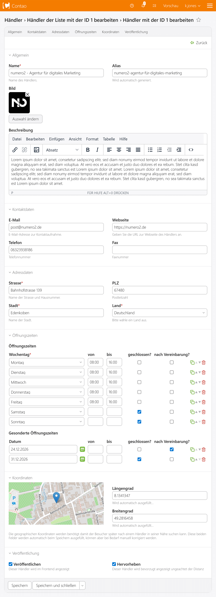

Contao StoreLocator
======================

[](https://packagist.org/packages/numero2/contao-storelocator) [](http://www.gnu.org/licenses/lgpl-3.0)

About
--

This extension offers the possibility to create multiple lists containing address data, contact information as well as opening times. From the Frontend the user can enter any possible address to see which stores are nearby (like on Google Maps). [Read more](https://www.numero2.de/contao/erweiterungen/storelocator.html)

> [!IMPORTANT]
> With version 5, the complete Google Maps integration has been updated. The map display now uses the `Google Maps Element`, and the address search is handled via the `Place Autocomplete Element`. If you are using customized templates, they **must be updated** to ensure compatibility with the new implementation.

Screenshot
--



System requirements
--

* [Contao 5.3](https://github.com/contao/contao) or newer
* [Google API Key](https://github.com/numero2/contao-storelocator/wiki/Google-Keys) (optional)

Installation
--

* Install via Contao Manager or Composer (`composer require numero2/contao-storelocator`)
* Run a database update via the Contao Manager or using the [contao:migrate](https://docs.contao.org/dev/reference/commands/) command.

Using other providers
--

StoreLocator comes pre-bundled with a provider for Google Maps as well as OpenStreetMap Nominatim.
If you want to use another provider you'll need to install additional packages:

| Package                           | Provider                |
|-----------------------------------|-------------------------|
| `geocoder-php/bing-maps-provider` | Bing Maps               |
| `geocoder-php/here-provider`      | HERE Maps               |
| `geocoder-php/open-cage-provider` | OpenCage                |


Events
--

By default the importer will populate the model with the fields for the current row and the key provided in the first row of the file. For custom handling feel free to use the `contao.storelocator_store_import` event:

```php
// src/EventListener/StoreImportListener.php
namespace App\EventListener;

use numero2\StoreLocatorBundle\Event\StoreImportEvent;
use numero2\StoreLocatorBundle\Event\StoreLocatorEvents;
use Symfony\Component\EventDispatcher\Attribute\AsEventListener;

#[AsEventListener(StoreLocatorEvents::STORE_IMPORT)]
class StoreImportListener {

    public function __invoke( StoreImportEvent $event ): void {
        // …
    }
}
```
